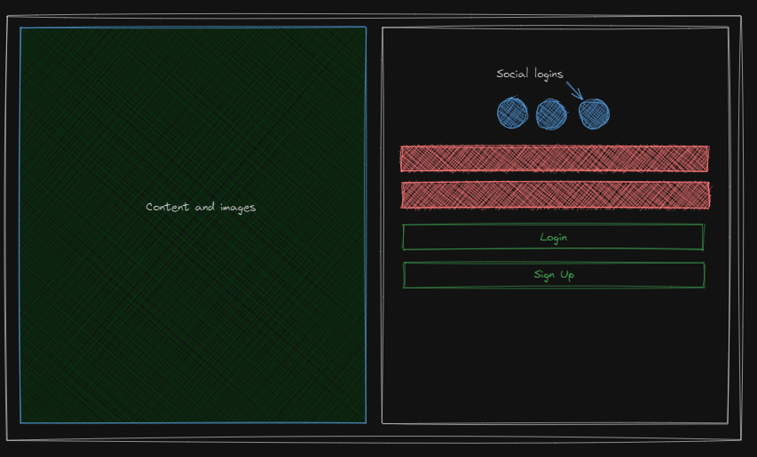
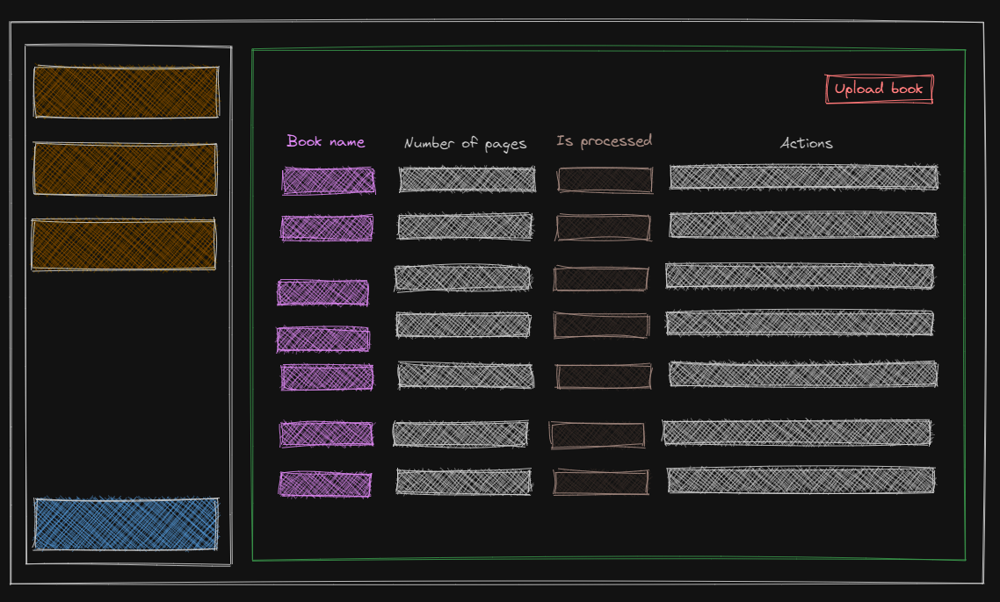

# Product requirements documentation (Short form)
## Product overview
As part of Q4 initiative of the company worden, a product is envisioned to facilitate the revenue brief. The product which
hereby will be referred as "Z" , will be developed to enable user to upload a book and able to read word information via
an api provided specific to each user. All the api will be tracked to ensure that user is charged.

## Target market
### Primary Users
The primary users are chatbots developers who can can use the word information to develop algorithms or provide continuous training
pipeline to chatbots they develop
### Secondary Users
The product can be also be used by analysts.
## Unique Value Proposition
Faster book processing
## Out of scope

1. Payment system
2. Analytics system

## Features (Success metrics )
### User management
1. User should be able to sign up using username and password
2. User should be able to login  using username and password
3. User should be able to change password
4. User should be able to sign in using linked-In
5. User should be able to sign up using google
6. User should be able to sign up using github

#### Wireframe

### Book management

1. User should be able to upload a book
2. User should be able to delete a book and remove from processing
3. User should be able to see the book information such as number of pages and word count for each page
4. User can deactivate a book for reading api
5. User can activate a book for reading api
6. User should be able to see a book is processed or not

#### Wireframe

### Charge Management

1. User should be able to see individual category of charges
2. User can view visual representation of daily charges
3. User should be able to see the total charge occurs till date from start of the billing period
4. User should be able to see past billing periods

#### Wireframe

### User experience
Dashboard sidebar

Profile screen

## Timeline and Roadmap

## Dependencies

1. Wanderer: a dataflow pipeline for processing books
2. Foreman: a microservice for recording and processing charges for customer
3. Bouncer: a user management service
4. Librarian: a service for book management
5. Aurora: Dashboard

## Future scope
End of thinking capacity.

