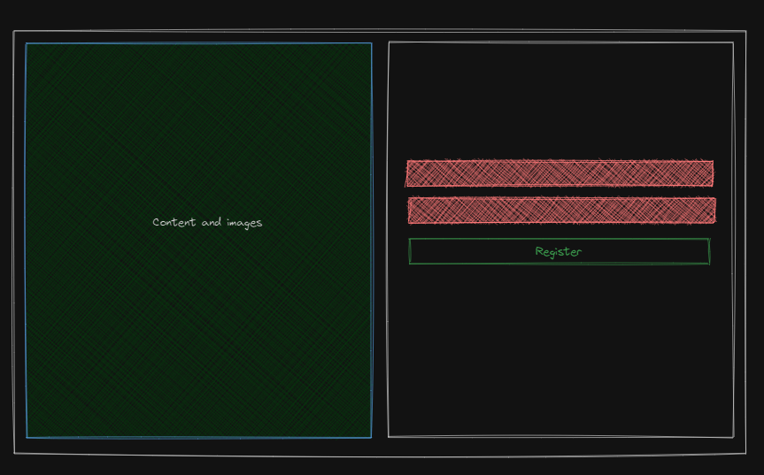
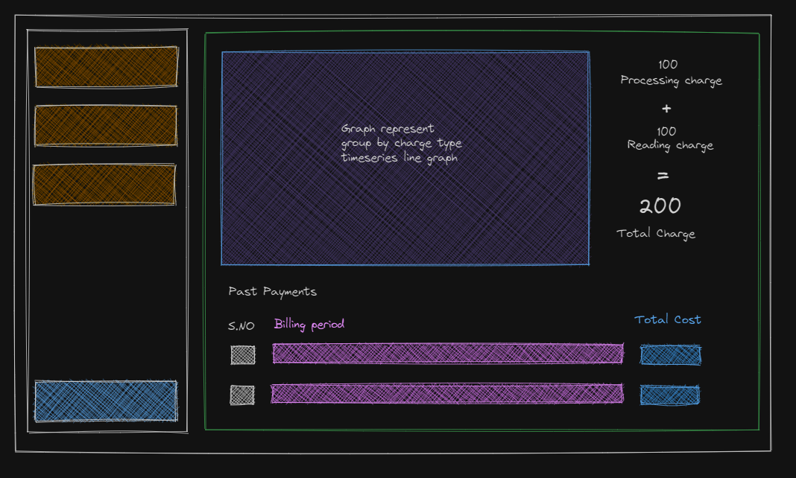

# Repo structure 
This is mono repo that holds different project, the following will help in quickly grasping where is what
- Assets:  Assets for readme
- Aurora: A monorepo for all frontend projects.
- Bouncer: A python project for user management 
- Foundation:  Pulumi code that holds the infrastructure in place.
- Foreman: A rust project that reads each user api usage and provide financial charges for each customer
- Wanderer: A java project that holds the code for the apache-beam pipeline processing
- Script:  A generalized scripts that used for the purpose of the project. Each script has its own use case
- Librarian: a service for book management

# Repo Description

This is showcase project to understand how dataflow and apache beam works. The project also introduces an effort towards
understand how company's revenue an d expectations are converted to technical software. In more realistic scenarios 
1. there are lot more process and lot more research goes into decision-making. 
2. There are more explanation for each product decision.

This project is simplified to just PRD and SRS to facilitate my need of learning. If any mistakes are found, please correct it by opening a PR . 

This project is developed to understand how to interact with the api and how to interface each application around the concepts 
of the apache beam technologies, spring boot. The project also focus on documentation of such use-cases as to how SRS, 
HLD and LLD designs are prepared to solve the use case. 
To facilitate this and having AI being the great interest in the recent time, Worden, a data company is imagined
and the following problem is described. 

`Imagined` being the keyword across all assumptions

# Worden
## Problem statement

### Revenue Brief 
Consider an AI company, Worden, that provides data to a chatbot. Worden focus on providing rich data for chat-box 
to train. The company is expected to generate around 1M per month and as part of the offering the following prices 
are to be charged to customers. The pricing is divide into 2 separate categories, Processing and Reading.

### Processing Charges

| Charge Type  | Price                 | Description                                                                                            | Limits                     | 
|--------------|-----------------------|--------------------------------------------------------------------------------------------------------|----------------------------|
| Book Process | 0.01 Dollar per  book | Charge price to customer for processing each book, this is a flat price irrespective of the book type. | 100 Books per user per day |
| Page Process | 0.001 Dollar per page | Each book will be charge at 0.01 per page irrespective of number of words per page                     | 10000 pages per book       |
| Word Process | 0                     | There is no charge for processing of word                                                              | NA                         |
| Book Score   | 0                     | There is no charge for processing of book score                                                        | NA                         |
| Page Score   | 0                     | There is no charge for processing of book score                                                        | NA                         |
| Word Score   | 0                     | There is no charge for processing of book score                                                        |   NA                       |

### Reading Charges
 
| Charge Type  | Write                  | Description                                             | Limits    |
|--------------|------------------------|---------------------------------------------------------|-----------|
| Read of page | 0.0001 Dollar per read | For each read of score for a page and word information  | No limit  |

# Product requirements documentation (Short form)
## Product overview
As part of Q4 initiative of the company worden, a product is envisioned to facilitate the revenue brief. The product which 
hereby will be referred as "Z" , will be developed to enable user to upload a book and able to read word information via 
an api provided specific to each user. All the api will be tracked to ensure that user is charged.

## Target market
### Primary Users
The primary users are chatbots developers who can can use the word information to develop algorithms or provide continuous training
pipeline to chatbots they develop
### Secondary Users
The product can be also be used by analysts.
## Unique Value Proposition
Faster book processing
## Out of scope

1. Payment system
2. Analytics system

## Features (Success metrics )
### User management
1. User should be able to sign up using username and password
2. User should be able to login  using username and password
3. User should be able to change password
4. User should be able to sign in using linked-In
5. User should be able to sign up using google 
6. User should be able to sign up using github

#### Wireframe

### Book management 

1. User should be able to upload a book
2. User should be able to delete a book and remove from processing
3. User should be able to see the book information such as number of pages and word count for each page
4. User can deactivate a book for reading api 
5. User can activate a book for reading api
6. User should be able to see a book is processed or not

#### Wireframe

### Charge Management

1. User should be able to see individual category of charges
2. User can view visual representation of daily charges
3. User should be able to see the total charge occurs till date from start of the billing period
4. User should be able to see past billing periods

#### Wireframe

### User experience
Dashboard sidebar

Profile screen

## Timeline and Roadmap

## Dependencies

1. Wanderer: a dataflow pipeline for processing books
2. Foreman: a microservice for recording and processing charges for customer
3. Bouncer: a user management service
4. Librarian: a service for book management
5. Aurora: Dashboard 

## Future scope
End of thinking capacity.

# Software design
As part the Q4 initiative, the following services are to be developed and each software will be assigned a pod for development
and maintenance of the project. 

## Foundation
A pulumi based infrastructure as code project. This enables the use of creating and destroying resources of the google project.

## Aurora
This is single monorepo for all the frontend projects. The purpose of provide a singular repo is to facilitate the re-use of developed
components and to ensure the entire frontend use the same design language for a simpler development.

## Bouncer
A  microservice that facilities user management

## Foreman
A microservice that facilities charge management

## Librarian
A microservice that facilities book management

## Wanderer
A apache beam pipeline that facilities processing of book

# SRS Wanderer

## Overview
As part of the PRD one of the step is to read from books and convert to  text. The text has to filtered out to be remove
articles, the text later will bed attached scores based on the length of the word and forward to other sinks. 
Each page of the book will have a page score with respect how many even length words are present , if and when such words
are same total word count will be present and if when total words match , page number will be considered for the purpose 
of scoring.

The scoring mechanisms is not planned to be decoupled as the scope of different types of scoring is not clear at this instant.

## Functional
- Only PDF books are to be accepted for processing.
- The pdf books are to be present as a single http/https link per book.
- All the books are expected to be in english

## Non-Functional
- Able to understand the time take to process each book
- The book is expected to be processed in less than half an hour (< 30 mins)
- The expected load is based on the revenue goal
  - Each user max income potential : (0.01 + (0.001*10000)) * 100 = 1001 dollars
  - 1mil/ 1001 = 999.000999 ~ 1000 such users per month
  - 1000/30 ~ 34 such books per day
  - Since each book may not have 10000 page , a more real world approach would be to consider ~1000 page per book
  - 1mil/(((0.01 + (0.001*1000)) * 100)*30) ~ 331 per day

## Risk
## Capacity Planning

- A cloud function will read the file in bucket and prepare a signed storage url
- The pre-generated urls will be pushed to pubsub topic
- The pipeline will read data from pub-sub topic and process the pdf file
- The generated text will be pushed to google firestore

## Resources
- https://cloud.google.com/storage/docs/access-control/signed-urls
- https://firebase.google.com/docs/firestore