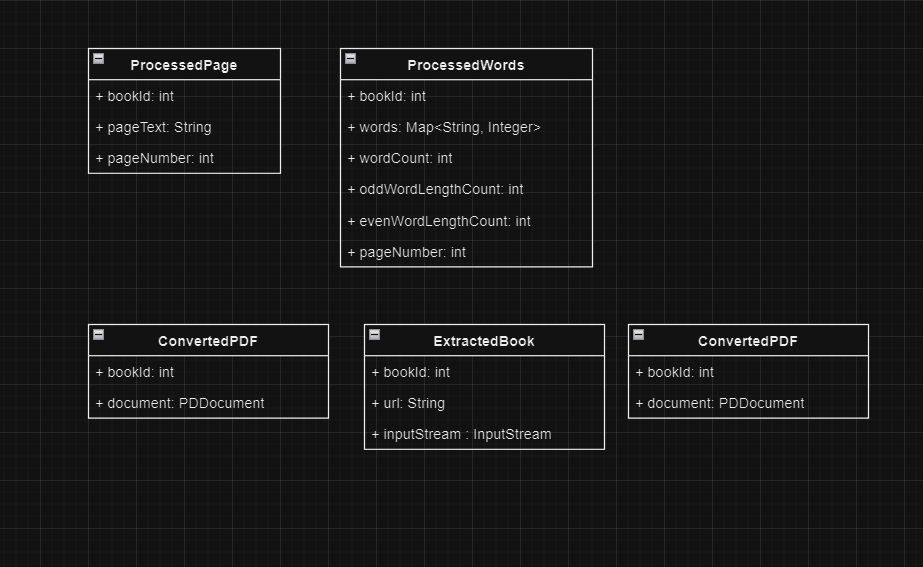
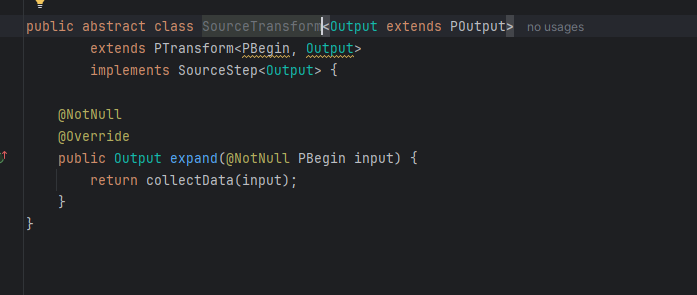
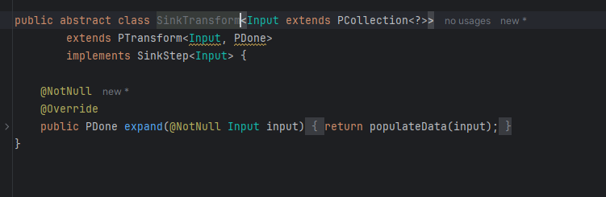
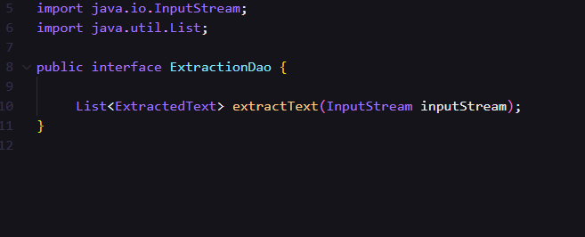
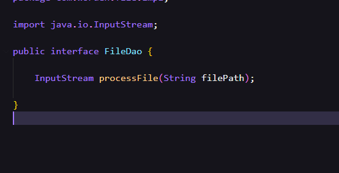
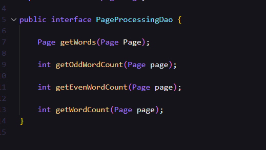
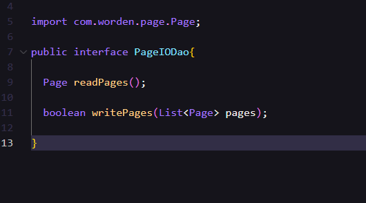

# Application Design Wanderer
`Wanderer` is a java project that holds pipeline definitions for the `Wanderer` project. This project will be developed 
using the beam sdk java and dataflow libs as provided in the SRS resources.
## Design

The pipelines `Reader` and `Processor` together essentially hold the ability to convert a given book in url from to 
extract text and score each page. The application code will be developed to ensure that the packaging is cohesive and 
robust for implementation. Keeping this as the main functionality the following functions are identified

1. Book : Holds code related to reading and writing book related information
2. File :  Holds code related to convert given file types into input stream
3. Extract : Holds code related to converting input stream into Paged text
4. Page :  Holds code related to processing page information

The following are expansion of PCollection names mentioned in the diagram
1. PPage : ProcessedPage
2. PWords: ProcessedWords
3. CPDF : ConvertedPDF
4. EBook: ExtractedBook
5. EText : ExtractedText

Addressing the aspect of pipeline two abstract classes will be designed which act as starting function of pipeline and 
ending step of pipeline respectively named as SourceTransform and SinkTransform. 

Fig : SourceTransform

Fig : SinkTransform

### Book 
A `BookService` class will be introduced that holds the funalities of reading book information from source and storing 
book information to sink. `BookDao` will be injected into `BookService` which collect books message from pub sub via `fetchBooks`.
The dao interface ensure that the implemented is abstracted and the service is not directly dependent on the underlying
implementation.

A `PubSubBookDao` will be developed that implements `BookDao`, providing the functionality on how to read pubsub message
and convert to required message.

A `BookConfig` class will be developed to maintain the object creation of the book package.

The rest of the features also follow a similar design, but have different interfaces.Highlighting the interfaces here to understand the contracts.

Fig : ExtractionDao

Fig : FileDao

Fig : PageProcessingDao

Score will added to `PageService` as there is no scope of expanding scoring. If when scoreing has to be expand, it is ideally recommeding to design as a different pipeline as this service will probablity reach EOL by the time the scoring is well established.

The IO operations with respective to store extracted text page and reterival of page wise text will be hanlded by `PageIODao` which will implmented by `FireStorePageIODao`. This provides a standard contract between sources, sink and application. All the contracts will be decoupled to maintain seperate objects for flow.

Fig: PageIODao

A similar design will be developed for pubsub IO operations as well

## Risk
1. PDDocument may not be serializable, in that case we will need to club two steps, i.e. `PrepareDocument` and `CollectPageText` into one in the graph.

## Deployment

## Resources

- https://beam.apache.org/documentation/programming-guide/#requirements-for-writing-user-code-for-beam-transforms