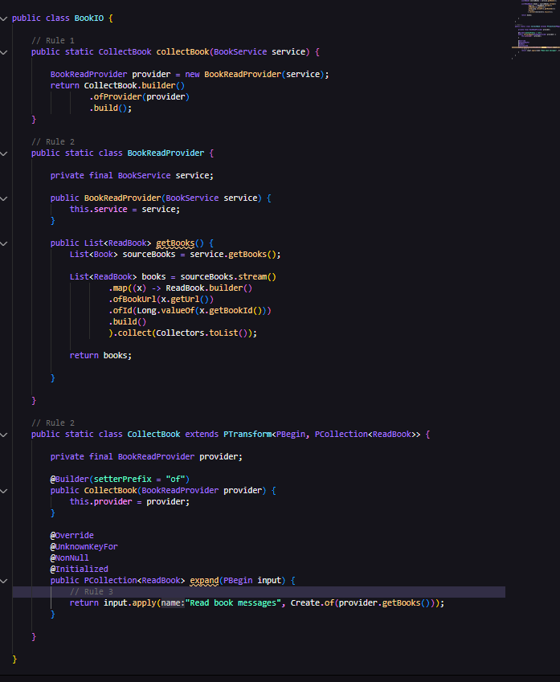

# Application Design Wanderer
`Wanderer` is a java project that holds pipeline definitions for the `Wanderer` project. This project will be developed 
using the beam sdk java and dataflow libs as provided in the SRS resources.
## Design

The application will be broken down into two modules, one will be `main` project that holds the pipeline code and other would be the `core` module that holds the business logic. The core module as of now is not planned for expansion as there is no re-usablity cases at this instant. The project will make use of the core module to run buiness logic functions. This ensures that pipeline design can be handled independently and business logic changes can be off loaded in the future if and when the pods is planned for scaling.

The pipelines `Reader` and `Processor` together essentially hold the ability to convert a given book in url from to extract text and score each page. The application code will be developed to ensure that the packaging is cohesive and robust for implementation. Keeping this as the main functionality the following functions are identified and will be added to the `core` module

1. Book : Holds code related to reading and writing book related information
2. File :  Holds code related to convert given file types into input stream
3. Extract : Holds code related to converting input stream into Paged text
4. Page :  Holds code related to processing page information

The following are expansion of PCollection names mentioned in the diagram
1. PPage : ProcessedPage
2. PWords: ProcessedWords
3. CPDF : ConvertedPDF
4. EBook: ExtractedBook
5. EText : ExtractedText
6. RBook : ReadBook

### Book 
A `BookService` class will be introduced that holds the funalities of reading book information from source and storing book information to sink. `BookDao` will be injected into `BookService` which collect books message from pub sub via `fetchBooks`.The dao interface ensure that the implemented is abstracted and the service is not directly dependent on the underlying implementation.

A `PubSubBookDao` will be developed that implements `BookDao`, providing the functionality on how to read pubsub message
and convert to required message.

A `BookConfig` class will be developed to maintain the object creation of the book package.

The rest of the features also follow a similar design, but have different interfaces.Highlighting the interfaces here to understand the contracts.

Fig : ExtractionDao

Fig : FileDao

Fig : PageProcessingDao

Score will added to `PageService` as there is no scope of expanding scoring. If when scoreing has to be expand, it is ideally recommeding to design as a different pipeline as this service will probablity reach EOL by the time the scoring is well established.

The IO operations with respective to store extracted text page and reterival of page wise text will be hanlded by `PageIODao` which will implmented by `FireStorePageIODao`. This provides a standard contract between sources, sink and application. All the contracts will be decoupled to maintain seperate objects for flow.

Fig: PageIODao

A similar design will be developed for pubsub IO operations as well

### Pipeline Design
Each pipeline will be a series of functions of directed acyclic graph. Each functions will be a PTransfrom that either collect data from external source or modifying the existing pcollection or push data to external source. To ensure that different beam functions are easy to understand the following rules will be followed
1. Each beam function will hold static method on how the exceution happens
2. Each beam function will hold all the static classes needed to completed the exceution
3. Each beam funciton will hold only the code related to execution but no business logic 

Here is an example towards how to stucture conside the following Book feature where the beam function collects information on how many books are there for steam processing

`BookReaderProvider` works as an interface between the data objects of the actual `Book` message and `ReadBook` PCollection for the pipeline. `CollectBook` is actual exceution pipeline for the application to explain how the pipeline is running. `collectBook` is a static method how provides the idea to how to excuete the `CollectBook` transform as part of the main pipeline. `BookService` is part of the core that holds the actual business logic towards the implementation of how fetch the book.

### Reader Pipeline design 

## Risk
1. PDDocument may not be serializable, in that case we will need to club two steps, i.e. `PrepareDocument` and `CollectPageText` into one in the graph.

## Deployment

## Resources

- https://beam.apache.org/documentation/programming-guide/#requirements-for-writing-user-code-for-beam-transforms